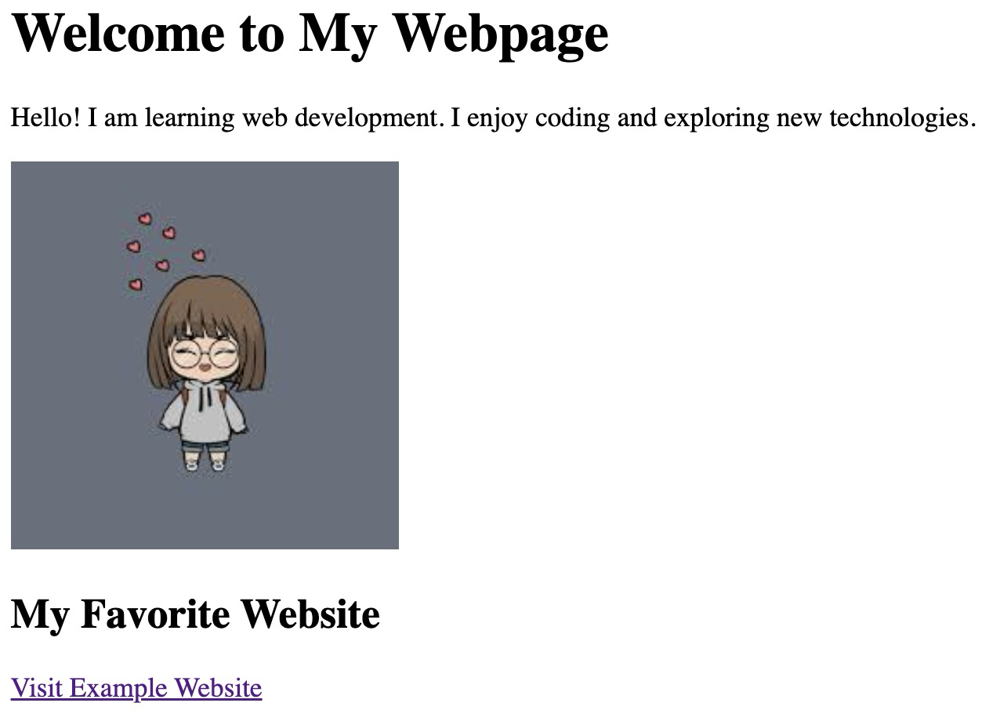

# Activity 1: **My First Webpage**

- **Create an HTML file named:** `firstpage.html`
- **Add a Main Heading:**  
  `Welcome to My Webpage`
- **Write a Short Introduction Paragraph:**  
  2–3 lines about yourself, your hobby, or anything you like.
- **Insert an Image:**  
  Any image from the internet.
- **Add a Subheading:**  
  `My Favorite Website`
- **Create a Link to Your Favorite Website:**  
  Use the `<a>` tag.

# Example Output:

