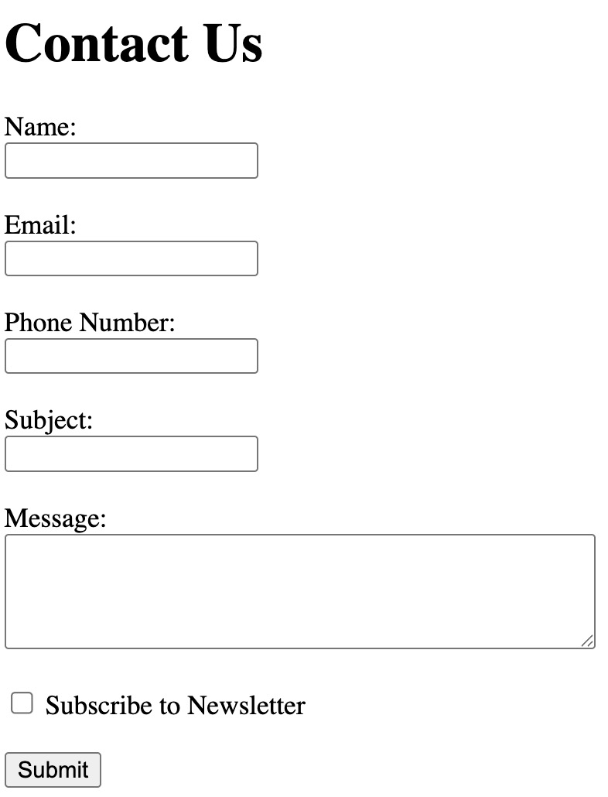

# **Create a Contact Form**

- **Create an HTML file named:** `contact_form.html`
- **Add a heading on the page:**  
  **Contact Us**
- **Build a form that includes the following fields:**
  - Name: Text input
  - Email: Email input
  - Phone Number: Tel input
  - Subject: Text input
  - Message: Multiline textarea
  - Subscribe to Newsletter: A checkbox
- **Include a Submit button.**

# Example output:
