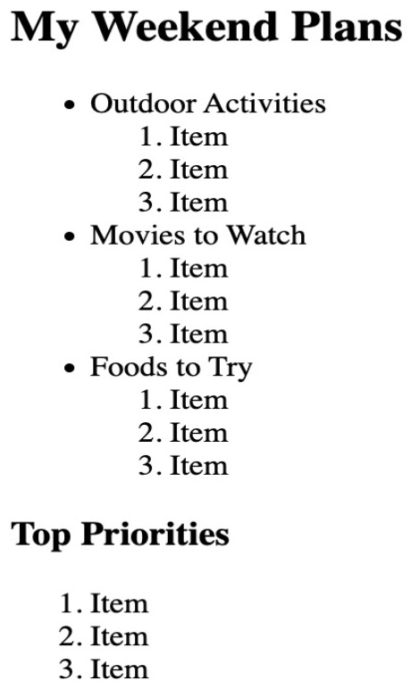

# **Weekend Plans List**

- **Create an HTML file named:** `weekend_plans.html`
- **Add a heading:**  
  “My Weekend Plans”
- **Create an unordered list (`<ul>`)** with 3 categories of plans, such as:
  - Outdoor Activities
  - Movies to Watch
  - Foods to Try
- **Inside each category (`<li>`), add a nested ordered list (`<ol>`)** of 3 specific items or tasks.
- **Add a separate ordered list titled “Top Priorities”** at the bottom, listing the 3 most important plans.

# Example Output:

