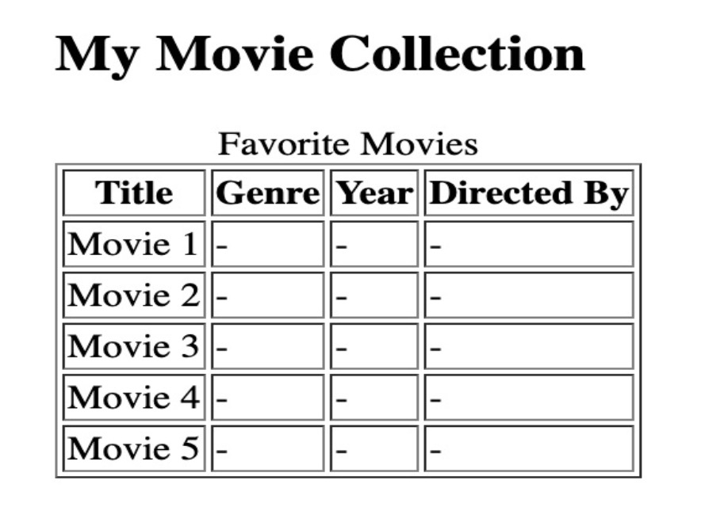

# **Movie Collection Table**

- **Create an HTML file named:** `movie_collection.html`
- **Add a heading:**  
  “My Movie Collection”
- **Columns:**  
  **Title, Genre, Year, Directed By**
- **Add at least 5 movie entries.**
- **Include a `<caption>`:**  
  “Favorite Movies”
- **Borders must be visible.**

# Example output:

