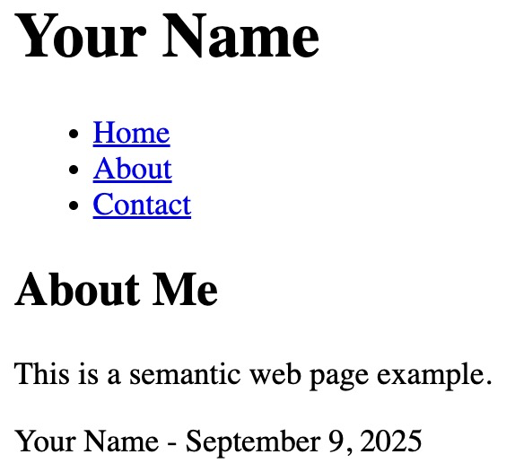

# **Build a Semantic Web Page**

- **Create a file named:** `about_me.html`
- **Add a `<header>` with your name as a heading.**
- **Add a `<nav>` with Home, About, Contact.**
- **Use a `<main>` to group the main content.**
- **Inside the main, create a `<section>` with one `<article>`:**
  - Add a subheading (`About Me`).
  - Add a paragraph with one word in a `` for emphasis.
- **Add a `<footer>` with your name and the current date.**

# Example Output: 
