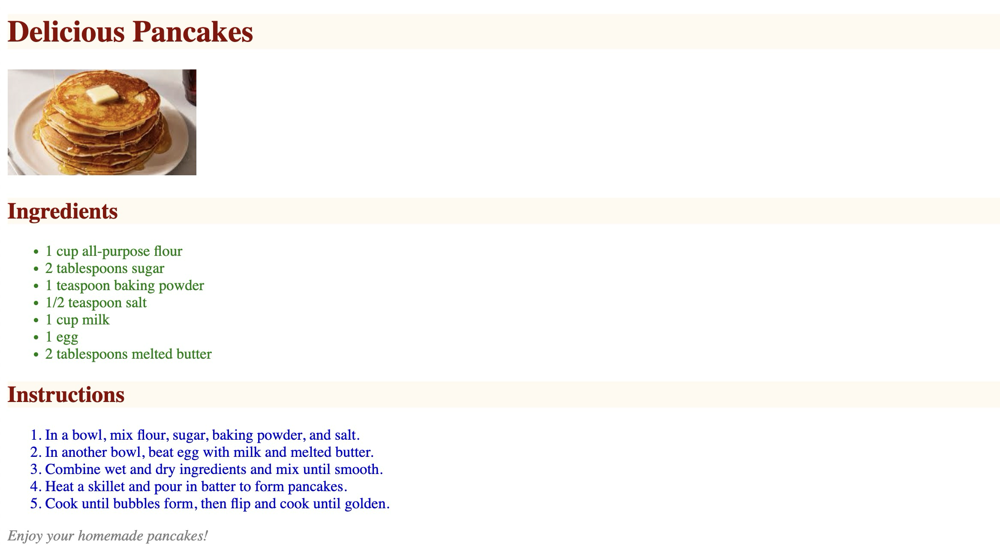

# How to Build and Style a Recipe Page

* Create a file named `recipe.html`.
* Use the provided HTML structure using **semantic tags** that contains: 
  - A header with the **main title** of the recipe.
  - An **image** of the dish.
  - An **ingredients** section with a list of ingredients.
  - An **instructions** section with step-by-step directions.
  - A footer with a **closing message**.
* Apply the following CSS:
  - Make the heading with text color **darkred** & background color **floralwhite**.
  - Change the text color of all list items inside the ingredients section to **green**.
  - Change the text color of all list items inside the instructions section to **mediumblue**.
  - Make the footer text *italicized* to give it some emphasis.

# Example Output: 
