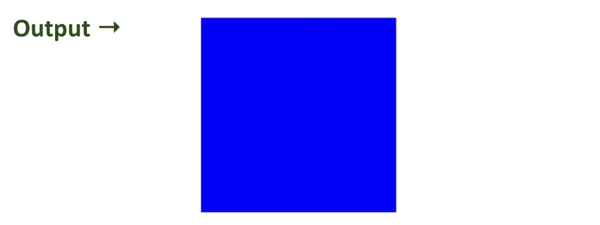
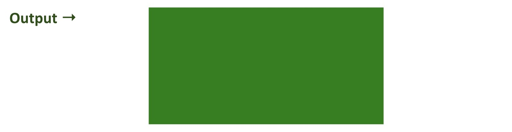
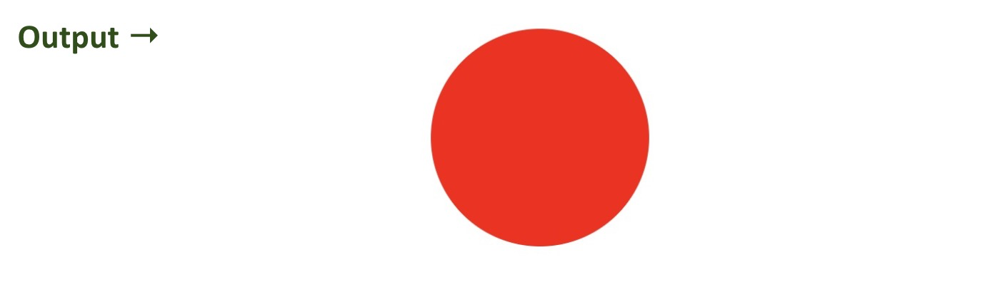
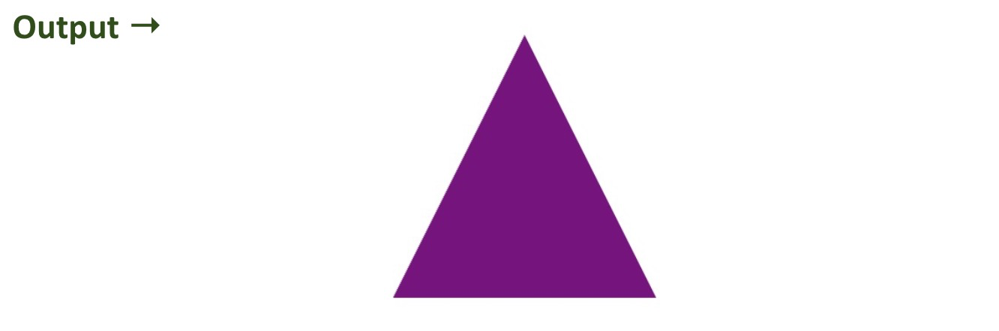
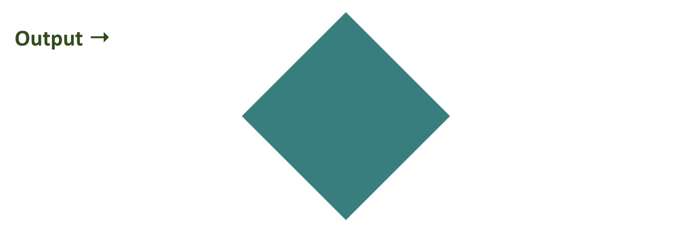

# CSS Shapes Activities

Complete the following activities by creating separate HTML files for each shape.

> Please ensure that the shapes are centered horizontally.

## Activity 1: Create a Square
- Make a **blue square** with a width and height of **150px**.
- Save your work in a file named `square.html`.

## Activity 2: Create a Rectangle
- Make a **green rectangle** with a width of **300px** and height of **150px**.
- Save your work in a file named `rectangle.html`.

## Activity 3: Create a Circle
- Make a **red circle** with a diameter of **150px**.
- Save your work in a file named `circle.html`.

## Activity 4: Create a Triangle
- Use a **zero-width, zero-height** `
` with **purple border color** to make a triangle shape.
- Save your work in a file named `triangle.html`.

## Activity 5: Create a Diamond Shape
- Make a **teal diamond** shape with a width and height of **150px**.
- Save your work in a file named `diamond.html`.

