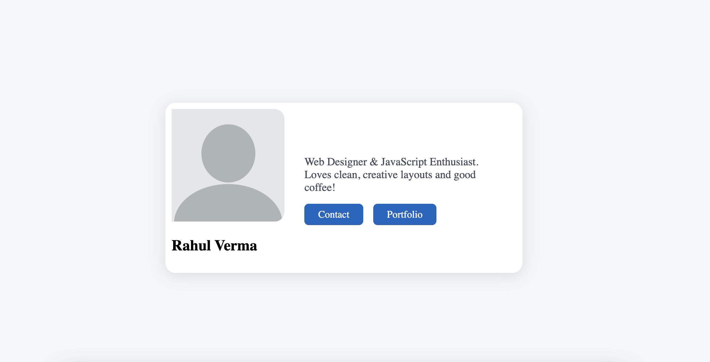
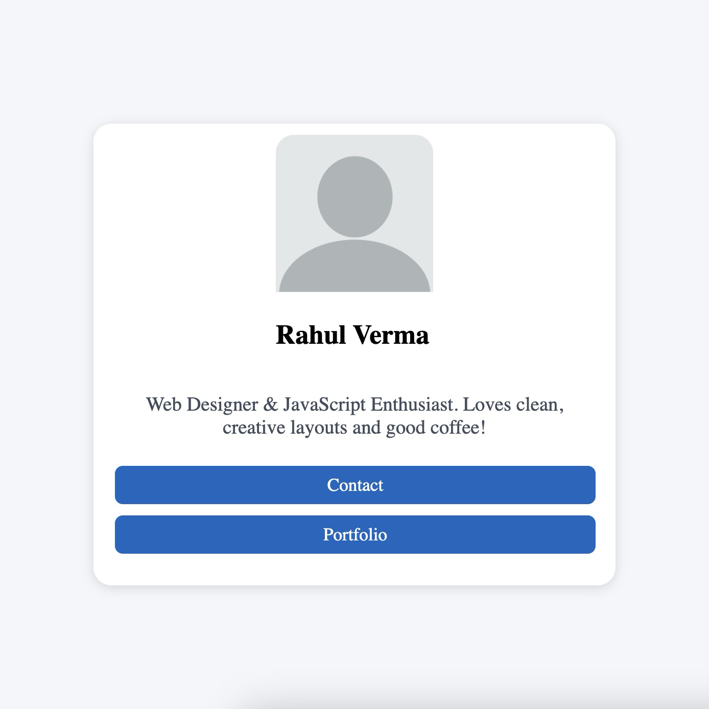

# Responsive Profile Card – Instructions 

## 1. Basic HTML Structure
- Create a `
` as the container.
- Inside, add:
  - An `` tag for the profile image.
  - Name and a short description using `<h2>` and `
`.
  - Two buttons or links: “Contact” and “Portfolio”.

## 2. Card Container Styling (Larger Screen)
- Set a fixed card width (e.g., 350-500px) and `margin: auto` to center.
- Use `background: white; border-radius: 16px; box-shadow` for a modern card look.
- Use `display: flex;` to place the image and info side by side.

## 3. Profile Image & Name Styling
- Make the image square (`width` and `height` equal, e.g., 130-180px).
- Use `object-fit: cover;` to prevent distortion.
- Add `border-radius: 50%` for a circular image.
- Style the name as bold and larger (`font-size: 1.5-2rem; font-weight: bold`).

## 4. Info Section Styling
- Add padding inside the info container for spacing.
- Make the description slightly lighter or smaller.

## 5. Button/Link Styling
- Style links as buttons: background color, white text, padding, rounded corners (`border-radius: 6-10px`).
- Use margin to space buttons apart horizontally.
- Add a simple hover effect (`background` or `opacity` change).

## 6. Make Responsive With Media Queries
- Use `@media (max-width: 640px)` or similar.
- Switch card layout from horizontal (`flex-direction: row;`) to vertical (`flex-direction: column;`).
- Set the card width to `70vw` and center it.
- Reduce image size and margin/padding for smaller screens.
- Stack the buttons vertically and extend their width for easy tapping (`width: 90%; display: block; margin: auto;`).

**Tip:**  
Test your profile card by resizing your browser window or using device emulation. Make sure everything stacks neatly and the card remains readable and visually appealing.
