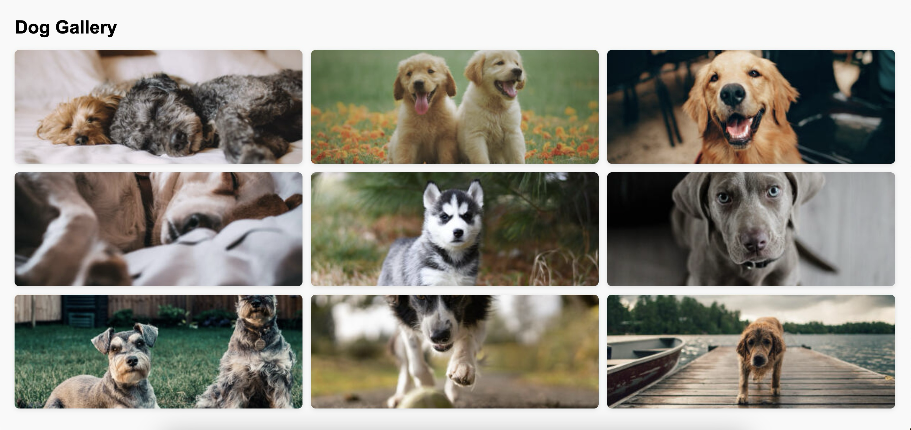

# Create a Responsive Dog Gallery Using CSS Grid

## Requirements:

- Create an HTML file named `dog-gallery.html`.
- Display **at least 9 images** of dogs in a grid layout.
- Use **CSS Grid** for the layout.
- Display grid with 3 equal columns.
- Make sure the gallery is **responsive**:
  - Show 3 columns on large screens (desktops).
  - Show 2 columns on medium screens (tablets).
  - Show 1 column on small screens (mobile devices).
- Add border-radius of 8px and a subtle shadow. 
- On hover, add a black border and stronger shadow.
- Images should scale nicely and maintain aspect ratio.
- Include 15px spacing (gap) between images.

## Tips:

- Use the CSS `object-fit: cover;` property on `` elements to ensure dog images fill their containers while maintaining aspect ratio. This prevents images from looking stretched or squished when resized.
- Use `gap` property in CSS Grid: Prefer `gap` instead of `margin` on grid items for consistent spacing without layout issues.
- Keep your CSS DRY (Don’t Repeat Yourself): Use reusable classes and avoid redundant rules to keep code clear and efficient.

# Example Output:

